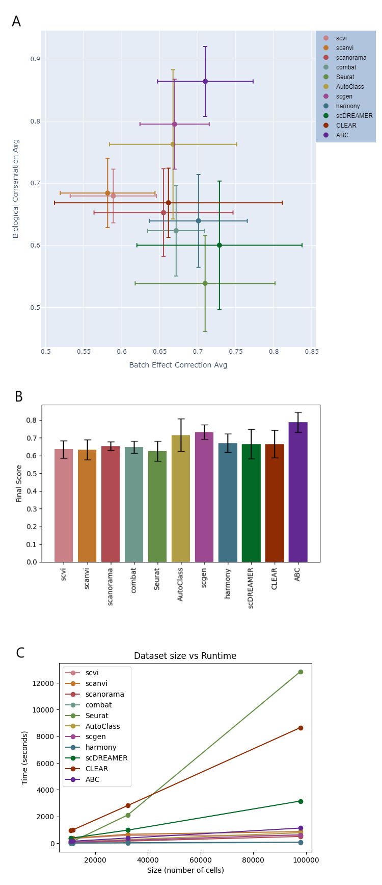

# ABC - Reproducibility

This repository holds scripts and results of a comparison made between ABC (a single cell sequencing 
data integration method) and the following integration methods: scgen, AutoClass, scanorama, combat,
Seurat, scVI, scANVI, harmony, CLEAR and scDREAMER. 

ABC (Autoencoder-based Batch Correction) is a semi-supervised deep learning architecture for integrating
single cell sequencing datasets. This method removes batch effects through a guided process of data compression
using supervised cell type classifier branches for biological signal retention. It aligns the different batches
using an adversarial training approach.
The package is available at: https://github.com/reutd/ABC.

## Main Results
We evaluated ABCs integration performance using four single cell sequencing datasets and using multiple 
measures for batch effect removal and biological variation conservation. The preprocessed datasets were
taken from: Luecken, M.D., Büttner, M., Chaichoompu, K. et al. Benchmarking atlas-level data integration 
in single-cell genomics. Nat Methods 19, 41–50 (2022). https://doi.org/10.1038/s41592-021-01336-8
and are publicly available as Anndata objects on Figshare at: https://doi.org/10.6084/m9.figshare.12420968.
All metrics were calculated using the package scib published with the above paper: 
https://github.com/theislab/scib.

Comparing the average results on four datasets: Human And Mouse Immune Cells, Human Lung Atlas,
Small mouse brain (ATAC) Peaks, Small mouse brain (ATAC) Windows, ABC displays a very good
balance between batch effect correction and biological variance conservation scores.

Full results can be found under "results/final_metrics" and a visualization of these results can be found
under "results/plots/metrics"